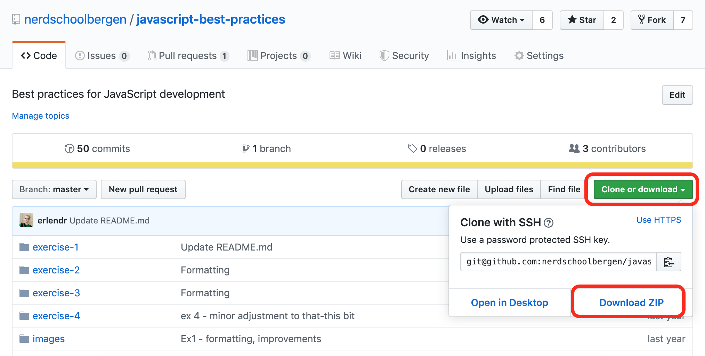

# JavaScript Best Practices


Best practices for JavaScript development

## [Open presentation slides](https://docs.google.com/presentation/d/1bqWOwNlzkLsnybM634-tgEdQEt-0j8Hg2Zzu2k6u31Y/edit?usp=sharing)

## Focus of this workshop

The focus of this workshop is best practices for JavaScript development. Rather than laying out "rules" to follow we are going to take a look a the _why_ behind the best practices, so that you can decide for yourself what's best for you.

## Audience

A basic understanding of JavaScript and it's syntax is required to get the most out of this workshop.

## What you need

- [Visual Studio Code](https://code.visualstudio.com/)
- [Node.js](https://nodejs.org)

### Installing Node.js


To install Node.js, download the latest _Long Term Service (LTS)_ release from [nodejs.org](https://nodejs.org).

### Installing Visual Studio Code


To install Visual Studio Code, please see the installation instructions for your platform:

- [Windows](https://code.visualstudio.com/docs/setup/windows/)
- [macOS](https://code.visualstudio.com/docs/setup/mac)
- [Linux](https://code.visualstudio.com/docs/setup/linux)

## How to get started

- Start by cloning this repository into a folder on your computer. If you've never used git before, you can alternatively click the green "Clone or download" button and then click on "Download ZIP". Unzip the downloaded file to a folder on your computer:



- Although you have this `README.md` file on your computer it's easier to read it on GitHub, so we recommend you keep this page open with the exercise tasks.

## Exercises

This repository contains a set of exercises organized in folders. Each folder contains a `README.md` describing the exercise.

- [Exercise 1 - Syntax](exercise-1/) (start here)
- [Exercise 2 - Equality](exercise-2/)
- [Exercise 3 - Hoisting and scope](exercise-3/)
- [Exercise 4 - Patterns](exercise-4/)

### Symbols and notation used in exercises

#### Icons with special meaning

:pencil2: - A task you should do  
:book: - A section of text to read (no tasks, just information).  
:bulb: - Additional information.  
:exclamation: - Something important.  
:question: - Open-ended question for the reader ("What do you think would happen if...")  
:poop: - Bad practice (don't-do-this)  
:star: - A bonus task (not required)  

#### Keyboard keys

Will look like this:

<kbd>CTRL</kbd> + <kbd>ALT</kbd> + <kbd>C</kbd>

#### Diff blocks

Emphasizes how lines of text should change.

```diff
- this text was removed
+ and replaced with this text
```
