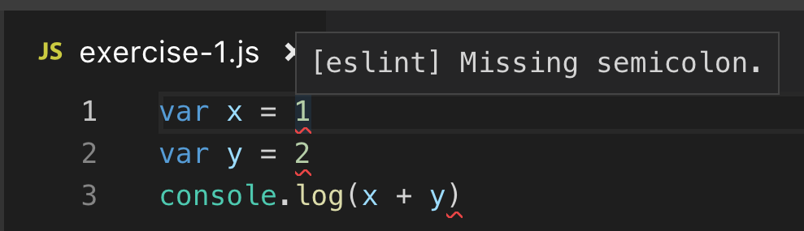

# Exercise 1 - Syntax

This exercise will focus on JavaScript syntax.

You will learn about:

- Semicolons and Automatic Semicolon Insertion (ASI)
- Linting
- Curly braces

## Required software and tools for this exercise

- [Visual Studio Code](https://code.visualstudio.com/)
- [Node.js](https://nodejs.org)

## 0.0 - Dev environment setup

:book: First, we need to do some preparation of our development environment.

### Node.js


:exclamation: In this workshop we are going to use the Node.js to run JavaScript code from the command line.

:pencil2: Download the latest _Long Term Service (LTS)_ release from [Node.js](https://nodejs.org). As of october 2019, the latest LTS release is 10.16.3. (It's also OK to use a newer version, if you know what you are doing.)

:pencil2: Open up a command line window (Command Prompt or Powershell in Windows or Terminal in macOS) and type the following command:

```bash
node -v
```

This should output something like this if Node is correctly installed:

```bash
v10.16.3
```

### Visual Studio Code


:exclamation: We are going to use Visual Studio Code (VS Code) to edit code.

:pencil2: To install Visual Studio Code, please see the installation instructions for your platform:

- [Windows](https://code.visualstudio.com/docs/setup/windows/)
- [macOS](https://code.visualstudio.com/docs/setup/mac)
- [Linux](https://code.visualstudio.com/docs/setup/linux)

### Exercise files

:pencil2: Start by cloning this repository into a folder on your computer. If you've never used git before, you can alternatively click the green "Clone or download" button and then click on "Download ZIP". Unzip the downloaded file to a folder on your computer.

#### Folder structure

:book: The repository contains a set of folders used for each exercise:

```bash
├── exercise-1
│   ├── .eslintrc.json
│   ├── exercise-1.js
│   └── README.md
├── exercise-2
│   ├── .eslintrc.json
│   ├── exercise-2.js
│   └── README.md
├── exercise-3
│   ├── .eslintrc.json
│   ├── exercise-3.js
│   └── README.md
├── exercise-4
│   ├── .eslintrc.json
│   ├── exercise-4.js
│   └── README.md
```

### Setting up the workspace in VS Code

:book: We need to open the folder containing the git repository you've just cloned/downloaded to your computer ("javascript-best-practices") as a _workspace folder_ in VS Code.

:pencil2: Choose _File -> Open_ from the VS Code menu and select the `javascript-best-practices` repository directory on your computer to set this folder as your _workspace folder_. _Make sure you select the directory, not a file inside the folder._

### Editing files in the workspace

:pencil2: Using the Explorer view on the left side of the VS Code window, try opening `exercise-1.js` inside the `exercise-1` folder. (If the Explorer view is not showing, click the Explorer icon in Activity Bar on the left side, or select _View -> Explorer_ from the menu.)

Now on to the real exercises!

## 1.1 - Semicolons

:book: You may have heard that "semicolons are optional in JavaScript", or that "semicolons are required". Well, both statements are true in some cases.

For example, the following code is perfectly valid JavaScript:

```js
var x = 1
var y = 2
console.log(x + y)
```

:book: So why does this work? JavaScript has a built in feature called _Automatic Semicolon Insertion (ASI)_. ASI inserts, as the name implies, semicolons in your code automatically before it is run. This means semicolons are _technically optional_ in JavaScript in many cases. However, there are some cases where not using semicolons can lead to problems. So in order to fully understand how this feature works, we will go through the rules.

There are three ASI rules:

### 1.1.1 - ASI Rule #1

:book: Rule #1 from the [JavaScript spesification](https://www.ecma-international.org/ecma-262/5.1/#sec-7.9.1) states:
> When, as the program is parsed from left to right, a token (called the offending token) is encountered that is not allowed by any production of the grammar, then a semicolon is automatically inserted before the offending token if one or more of the following conditions is true:
> - The offending token is separated from the previous token by at lest one _LineTerminator_.
> - The offending token is `}`.

What does this mean? Let's break down the terms:

- **Parsing**: The process of converting your code into a _syntax tree_ before compiling it.
- **Token**: A token is a piece of code, for example `var`, `x`, `=`, and so on.
- **Offending token**: A piece of code that cannot be placed after the previous piece of code.
- **Grammar**: The syntax rules that JavaScript follows.
- **LineTerminator**: A line break in the code (new line).

Let's name each of the conditions of the first rule a and b:

#### ASI Rule 1.a

:book: As we saw earlier, the first condition of ASI Rule #1 states:
> The offending token is separated from the previous token by at least one _LineTerminator_.

So, in what cases will this be true? Consider the following code:

```js
var x = 1
var y = 2
if(x>0){y=3}
console.log(y)
```

:book: If we read this code from the left to the right, the last token before line 1 ends is `1`.
The next token is on line 2, hence it is separated from the last token by a "LineTerminator", or a line break. The next token is `var`, which is not valid grammar if you place it after the previous token: `1 var`.

Because of this first condition, a semicolon will therefore be inserted at the end of the first line and the second line (because `2 if` is not valid syntax):

```js
var x = 1;
var y = 2;
if(x>0){y=3}
console.log('hello world')
```

#### ASI Rule 1.b

:book: The second condition of ASI Rule #1 states:
> The offending token is }.

Let's look at the code from after applying rule 1.a:

```js
var x = 1;
var y = 2;
if(x>0){y=3}
console.log('hello world')
```

Next, the parser reads line 3 from left to right, and encounters a closing curly brace (`}`) after variable assignment `y=3`. `y=3}` is not valid syntax, and the result
is that a semicolon is inserted before the so called _offending token_ (closing curly brace):

```js
var x = 1;
var y = 2;
if(x>0){y=3;}
console.log('hello world')
```

### 1.1.2 ASI Rule #2

:book: Rule #2 from the JavaScript spesification states:
> When, as the program is parsed from left to right, the end of the input stream of tokens is encountered and the parser is unable to parse the input token stream as a single complete ECMAScript Program, then a semicolon is automatically inserted at the end of the input stream.

Again, let's break down the terms:

- **Input stream**: A sequence of text characters representing the code
- **ECMAScript Program**: A piece JavaScript code can be compiled and run

When reading the last line from left to right, the parser encounters the end of the line and the end of the script. A semicolon is therefore inserted at the end of the _input stream_, or after the closing paren in `console.log('hello world')`:

```js
var x = 1;
var y = 2;
if(x>0){y=3;}
console.log('hello world');
```

### 1.1.3 ASI Rule #3

:book: The last rule is difficult to read from the spesification, but the gist of it is:

> If a line break is encountered at where it is not allowed according to the grammar rules, insert a semicolon

So, in what cases does this apply? Let's have a look at the `return` statement in the following code:

```js
function addTwoNumbers(a, b) {
  return
  (a+b)
}
console.log('Result:', addTwoNumbers(1,2))
```

:question: What do you think the output of this code will be?

:pencil2: Try adding the code above to `exercise-1.js`.

To run the code using Node.js, do the following:

1. Open a command line window (Command Prompt or Powershell in Windows or Terminal in macOS)
2. Navigate into the folder where you cloned this repository, for example `c:\mygitrepos\javascript-best-practices\` in Windows or `/mygitrepos/javascript-best-practices/` in macOS/Linux.
3. Run the `exercise-1.js` file by typing:

Windows:

```powershell
node exercise-1\exercise-1.js
```

macOS/Linux:

```bash
node exercise-1/exercise-1.js
```

The output of the program should now be printed on the next line after the `node` command.

:question: The answer is `undefined`. Why is this?

:book: The `return` statement expects an expression as the next token at _the same line_. In this case, the expression `(a+b)` is placed on the next line after the `return` statement,
so in order to correct this syntax error a semicolon is inserted after the return statement:

```js
function addTwoNumbers(a, b) {
  return;
  (a+b);
}
console.log('Result:', addTwoNumbers(1,2))
```

:book: The `return` statement in the first line now returns `undefined` and then exits the function. Therefore, the `(a+b)` expression on the next line will never be returned.

:pencil2: Try modifying the code so that the `addTwoNumbers()` function returns the correct result. Run the code again using Node.js to verify the result.

:book: This problem applies to the following statements:

- `continue`
- `break`
- `return`
- `throw`
- `yield`
- postfix `++` or `–`

:bulb: The only exception to ASI Rule #3 is `for` statements, ASI never inserts semicolons inside the parenthesis of a `for` statement.

:exclamation: **Best practice:** _Use semicolons_. If you insist on not using them, learn the ASI rules well to avoid trouble.

:bulb: For reference: [The ECMAScript 5.1 spec - ASI rules](http://www.ecma-international.org/ecma-262/5.1/#sec-7.9)

Now on to some more interesting stuff!

## 1.2 - Linting

:book: According to Wikipedia, the definition of a _lint_ in the context of software is:

> Generically, lint or a **linter** is any tool that detects and flags errors in programming languages, including stylistic errors

Because of the nature of JavaScript, with it's syntax rarities and potential pitfalls,
using a tool to analyse your JavaScript will help you write better code.

There are several JavaScript linting tools available, for this workshop we have chosen [ESLint](https://eslint.org/) because of it's configurability and number of linting rules available.

### 1.2.1 - ESLint overview


:book: ESLint will analyse your JavaScript code and return a set of errors or warnings depending on which linting rules you have configured it to use.

ESLint divides it's rules into several categories. From the [rules documentation](https://eslint.org/docs/rules/):

- **Possible errors** - These rules relate to possible syntax or logic errors in JavaScript code
- **Best Practices** - These rules relate to better ways of doing things to help you avoid problems
- **Variables** - These rules relate to variable declarations
- **Node.js and CommonJS** - These rules relate to code running in Node.js, or in browsers with CommonJS
- **Stylistic Issues** - These rules relate to style guidelines, and are therefore quite subjective
- **ECMAScript 6** - These rules relate to ES6, also known as ES2015

:exclamation: This workshop will _not_ go through all possible rules (as there are too many), instead we will focus on a _small subset of rules_ that illustrate the best practices we are going to cover in the exercises.

### 1.2.2 - Getting ESLint up and running

:book: ESLint can be run in multiple ways:

- From the command line
- Via a code editor (many integrations available)
- Via a build tool
- Via source control
- Via tests
- In a browser
- ...and more

For this workshop we are going to run ESLint in VS Code via an editor extension called [VS Code ESLint extension](https://marketplace.visualstudio.com/items?itemName=dbaeumer.vscode-eslint).

:pencil2: The _ESlint extension_ for VS Code requires that you install the _ESLint linter_ globally or inside the workspace folder that contains the JavaScript code to be validated. For ease of use we are going to do the former.

#### Installing ESLint

:pencil2: Open a command line window (Command Prompt or Powershell in Windows or Terminal in macOS)

:pencil2: Run the following command:

```bash
$ npm install -g eslint
...
+ eslint@5.7.0
added 125 packages from 149 contributors in 50.478s
```

:pencil2: Verify that eslint is working by running ESLint from the command line using the NodeJS `npx` command:

```bash
$ npx eslint
eslint [options] file.js [file.js] [dir]
...
```

#### Installing the ESLint extension for VS Code

:pencil2: To install the _ESLint extension_ in VS Code, use the Extensions view. Bring up the Extensions view by clicking on the Extensions icon in the Activity Bar on the side of VS Code.


:pencil2: Type in "Eslint" into  the search box at the top of the Extensions view and select the _ESLint extension_ in the search results. Install the extension by clicking the green "Install" button.


### 1.2.3 - Configuring ESLint

:book: By default no rules are enabled in ESLint. In order to configure ESLint we need to create a file named `.eslintrc.json` in the `exercise-1` folder. To make things easier we have already added this file for you. (New to the JSON format? [Read about it here](https://developer.mozilla.org/en-US/docs/Learn/JavaScript/Objects/JSON).)

:pencil2: Add the following line to enable the [`semi` rule](https://eslint.org/docs/rules/semi):

```diff
{
    "rules": {
+       "semi": "error"
    }
}
```

:exclamation: This rule enforces consistent use of semicolons by reporting an _linting error_ if the rule is violated.

### 1.2.4 - Running ESLint while editing code

Open `exercise-1.js` in the `exercise-1` folder and enter the following JavaScript code:

```js
var x = 1
var y = 2
console.log(x + y)
```

If everything is configured correctly, VS Code will notify you that the code
you just entered has some linting errors:



:pencil2: Correct the errors in the code, and watch the red squiggly underlines in the editor disappear.

## 1.3 - Curly braces

:book: If you are used to C# or Java syntax, the following curly brace code style (called Allman style) will seem like the correct way to place opening curly braces:

```js
function myFancyFunction()
{
  return "Important stuff";
}

function myOtherFunction()
{
  // Do stuff
}

function myFunctionReturningAnObject()
{
  return
  {
    name: "Mad Max",
    age: 35
  };
}
```

:book: Because of ASI the return statement in the last function will get a semicolon inserted and the code will break because of the opening curly brace on the next line. Enter the code above into the `exercise-1.js` file. You will notice that VS Code will notify you that the code has syntax errors.

:pencil2: Fix the syntax error by placing the opening curly brace on the same line as the the return statement.

:exclamation: Notice that now you have two different styles of placing curly braces, the Allman (C#/Java) style for the functions and the open curly brace on same line style (required because of the return statement).

:pencil2: This creates confusion, so we can configure ESLint to enforce a curly brace style via the [`brace style`](https://eslint.org/docs/rules/brace-style) rule:

```diff
{
    "rules": {
      "semi": "error",
+     "brace-style": "error"
    }
}
```

:exclamation: Remember to insert a comma at the end of the `"semi"`-line above!

:book: The [`brace style`](https://eslint.org/docs/rules/brace-style) rule defaults to a style called _one true brace style_, which is the most common brace style in JavaScript and corresponds with how the return statement is formatted.

:pencil2: Open the `exercise-1.js` code again and you should see that VS Code will
notify you that the opening curly braces for the functions are misplaced.

:pencil2: Fix the styling error by moving the opening curly braces.

:exclamation: **Best practice:** _Use the one true brace style_ for braces in your code.

## Exercise 1 best practices summary

So far, we've covered the following:

- _Use semicolons_. If you insist on not using them, learn the ASI rules well to avoid trouble.
- _Use a linter (like ESLint) to help you write better code_.
- _Use the one true brace style_ for braces in your code.

## [Go to exercise 2 ==>](../exercise-2/README.md)
